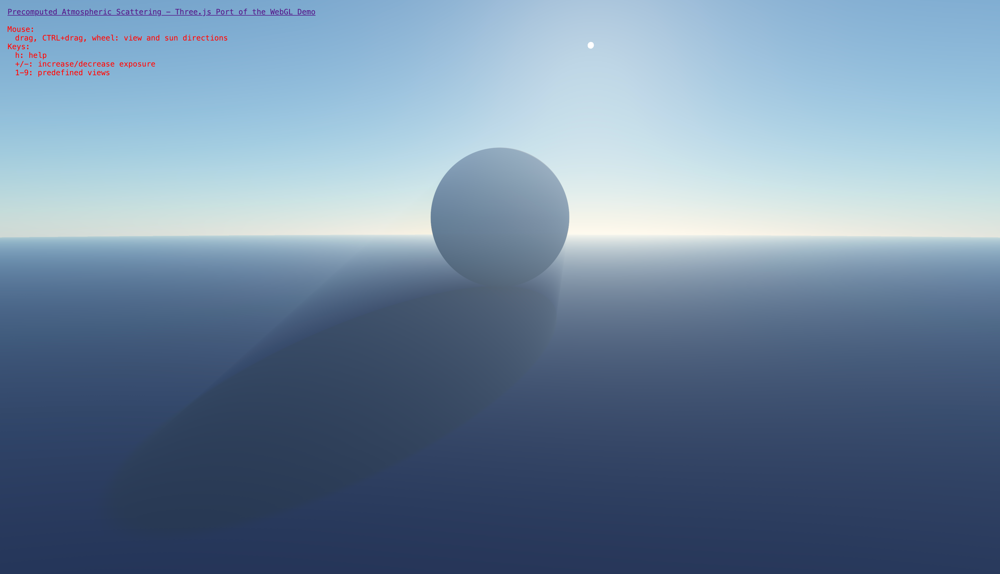

# Three.js Precomputed Atmospheric Scattering

A Three.js implementation of Eric Bruneton's [Precomputed Atmospheric Scattering](https://ebruneton.github.io/precomputed_atmospheric_scattering/index.html) model.



**[Live Demo](https://jeantimex.github.io/precomputed_atmospheric_scattering/)**

## Overview

This project is a port of Eric Bruneton's physically-based atmospheric scattering model to Three.js. The original implementation uses WebGL directly, while this version integrates the same atmospheric rendering techniques with the Three.js framework, making it easier to incorporate realistic atmospheric effects into Three.js applications.

The atmospheric scattering model simulates:
- Rayleigh scattering (scattering by air molecules)
- Mie scattering (scattering by aerosols/particles)
- Ozone absorption
- Multiple scattering effects
- Ground reflections
- Realistic sun rendering

## Features

- **Physically-Based Rendering**: Implements a full physically-based atmospheric scattering model
- **Precomputed Textures**: Uses precomputed lookup tables to achieve real-time performance
- **Three.js Integration**: Seamlessly works with the Three.js rendering pipeline
- **Interactive Controls**: Adjust view direction, sun position, and exposure
- **Modular Shader Structure**: Well-organized GLSL code split into separate modules:
  - `vertex.js`: Handles vertex transformations and view ray calculations
  - `atmosphere.js`: Contains the core atmospheric scattering computations
  - `fragment.js`: Renders the sky, ground, and objects with atmospheric effects

## Demo

You can interact with the demo using:
- **Mouse**: 
  - Drag to change view direction
  - CTRL+drag to change sun direction
  - Mouse wheel to zoom
- **Keyboard**:
  - Press 'h' to toggle help
  - Press '+'/'-' to increase/decrease exposure
  - Number keys (1-9) for preset views:
    - 1: Daytime
    - 2: Sunset
    - 3: Sunset with mountains
    - 4: Sunset with mountains (different angle)
    - 5: Morning
    - 6: Night
    - 7: Night with mountains
    - 8: High altitude
    - 9: Space view

## Development

### Prerequisites

- Node.js and npm (for development tools)
- A modern web browser with WebGL support

### Getting Started

1. Clone the repository:
   ```bash
   git clone https://github.com/jeantimex/precomputed_atmospheric_scattering.git
   cd precomputed_atmospheric_scattering
   ```

2. Install dependencies (if any):
   ```bash
   npm install
   ```

3. Start a local development server:
   ```bash
   npm run dev
   ```

4. Open your browser and navigate to `http://localhost:8000` (or the port specified by your server)

### Modifying the Shaders

The shader code is organized into three main files:

1. **vertex.js**: Contains the vertex shader that calculates view rays
2. **atmosphere.js**: Contains the core atmospheric scattering model
3. **fragment.js**: Contains the fragment shader that renders the scene

When modifying the shaders:
- Ensure proper imports between shader files
- Maintain the GLSL comment tag syntax (`/* glsl */`) before template literals
- Test changes incrementally to isolate any issues

## Credits

- Original implementation by [Eric Bruneton](https://ebruneton.github.io/precomputed_atmospheric_scattering/index.html)
- Based on the paper "Precomputed Atmospheric Scattering" by Eric Bruneton and Fabrice Neyret

## License

This project maintains the original license from Eric Bruneton's implementation. See the LICENSE file for details.
